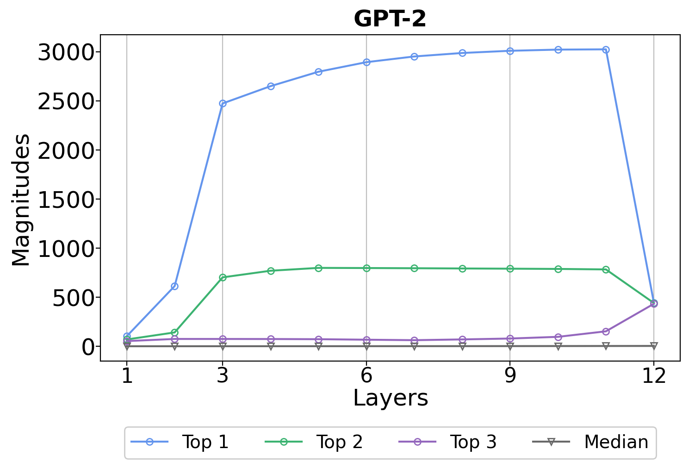
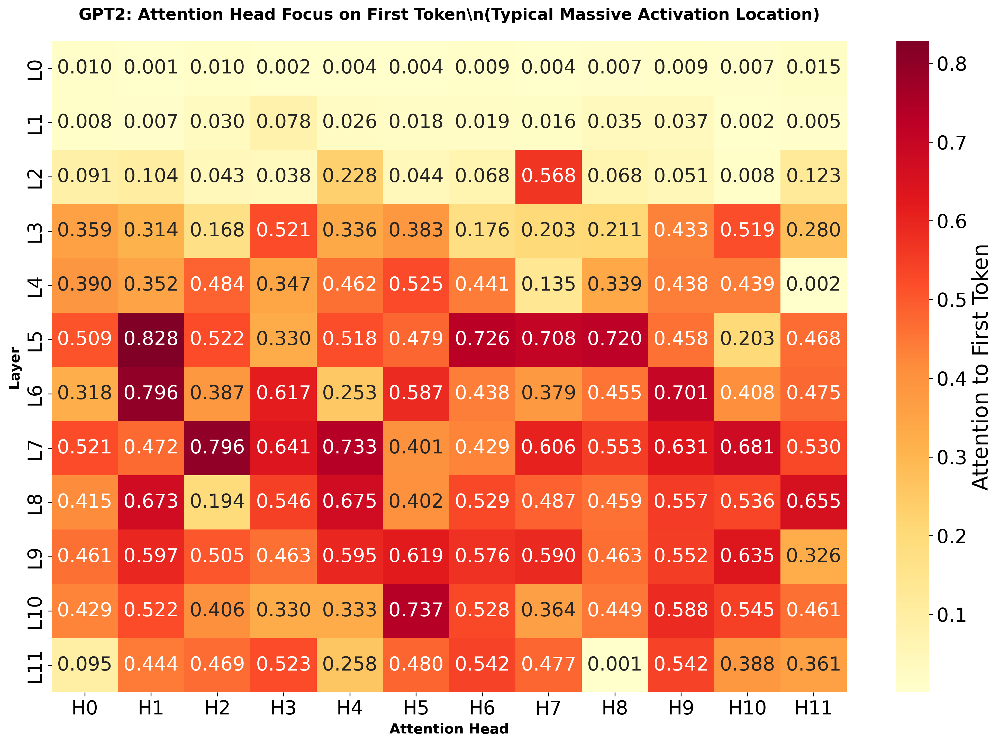
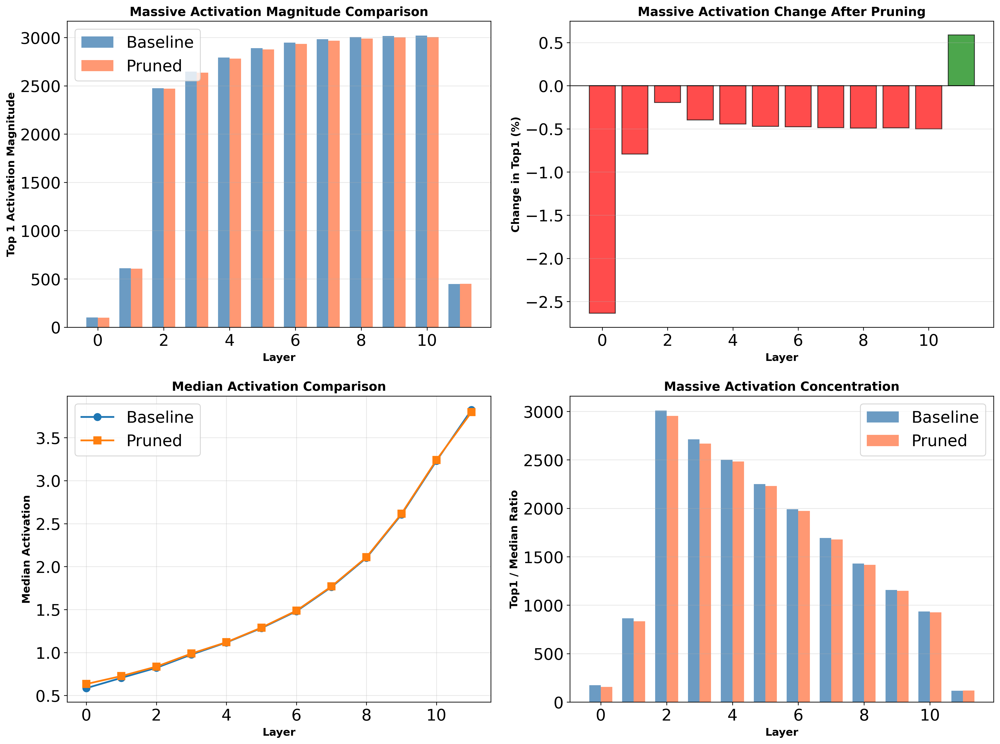
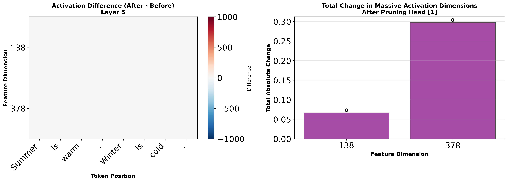

# Attention Head Pruning and Massive Activations Analysis

<div align="center">


**Investigating the relationship between attention heads and massive activations in large language models**

[📖 Overview](#overview) • [🔬 Key Findings](#key-findings) • [📊 Visualizations](#visualizations) • [🚀 Quick Start](#quick-start) • [中文版](README_CN.md)

</div>

---

## 📖 Overview

This research explores the phenomenon of **"Massive Activations"** in GPT-2 and investigates whether attention heads are responsible for generating these extreme activation values. Through systematic experiments, we identify which heads focus on massive activations and test whether pruning them affects these activations.

### Research Questions

1. **What are massive activations?** Certain feature dimensions exhibit activation values 300-3000× larger than the median.
2. **Which attention heads focus on these activations?** We analyze all 144 heads (12 layers × 12 heads) in GPT-2.
3. **Do these heads generate massive activations?** We prune the most important heads and measure the impact.

### 🎯 Surprising Discovery

**Massive activations are NOT generated by attention heads!** Even pruning the highest-scoring heads (attention score: 0.828) results in **0% change** in massive activation magnitudes. This suggests massive activations are an emergent network property, likely originating from MLP layers or multi-layer interactions.

---

## 🔬 Key Findings

### 1️⃣ Massive Activations Exist and Follow Clear Patterns

<div align="center">



**Figure 1: Massive Activation Magnitude Across Layers**

</div>

#### Observations:
- **Early Layers (0-1)**: Low activation values (<1000)
- **Middle Layers (2-4)**: Rapid growth phase (~2500)
- **Deep Layers (5-10)**: Stable high plateau (~3000)
- **Final Layer (11)**: Sharp drop (~400)
- **Top1/Median Ratio**: 300-3000× across layers

#### Statistics:

| Layer | Top 1 | Top 2 | Top 3 | Median | Ratio |
|-------|-------|-------|-------|--------|-------|
| 0     | 101   | 100   | 50    | 0.60   | 168×  |
| 2     | 2475  | 703   | 101   | 0.84   | 2946× |
| 5     | 2890  | 834   | 179   | 1.28   | 2258× |
| 10    | 3019  | 862   | 214   | 2.61   | 1157× |

---

### 2️⃣ Attention Heads Show Clear Specialization

<div align="center">



**Figure 2: Attention Head Focus on Massive Activation Tokens (First Token)**

</div>

We measured how much each head attends to the first token (where massive activations commonly appear).

#### Top 10 Most Important Heads:

| Rank | Layer | Head | Attention Score | Description |
|------|-------|------|-----------------|-------------|
| 🥇 1 | 5     | 1    | **0.828**       | Highest overall |
| 🥈 2 | 6     | 1    | 0.796           | Deep layer specialist |
| 🥉 3 | 7     | 2    | 0.796           | Deep layer specialist |
| 4    | 10    | 5    | 0.737           | Late layer focus |
| 5    | 5     | 6    | 0.726           | Mid-layer cluster |
| 6    | 7     | 4    | 0.733           | Deep layer |
| 7    | 5     | 8    | 0.720           | Mid-layer cluster |
| 8    | 6     | 9    | 0.701           | Deep layer |
| 9    | 2     | 7    | 0.568           | Early important head |
| 10   | 8     | 4    | 0.675           | Deep layer |

#### Bottom 5 Least Important Heads (Safe to Prune):

| Rank | Layer | Head | Attention Score | Status |
|------|-------|------|-----------------|--------|
| 1    | 0     | 1    | 0.001           | ✅ Minimal impact |
| 2    | 4     | 11   | 0.002           | ✅ Minimal impact |
| 3    | 11    | 8    | 0.001           | ✅ Minimal impact |
| 4    | 1     | 10   | 0.002           | ✅ Minimal impact |
| 5    | 0     | 3    | 0.002           | ✅ Minimal impact |

<div align="center">


**Figure 3: Head Importance Patterns Across Layers**

</div>

---

### 3️⃣ Pruning Top Heads Has Minimal Impact on Massive Activations

<div align="center">


**Figure 4: Impact Comparison - Pruning Different Heads**

</div>

#### Experiment Design:

**Experiment A: Prune TOP Heads** (Most related to massive activations)
- Layer 2, Head 7 (score: 0.568)
- Layer 5, Head 1 (score: 0.828) ⭐ Highest scoring head
- Layer 6, Head 1 (score: 0.796)

**Experiment B: Prune BOTTOM Heads** (Least related)
- Layer 0, Head 1 (score: 0.001)
- Layer 4, Head 11 (score: 0.002)
- Layer 11, Head 8 (score: 0.001)

#### Results:

| Experiment | Avg Change | Max Change | Impact |
|-----------|-----------|-----------|---------|
| **Prune TOP Heads** | **+0.06%** | +0.73% (Layer 11) | ⚠️ Almost none |
| **Prune BOTTOM Heads** | **-0.57%** | -2.64% (Layer 0) | ❗ 7× larger! |

**Unexpected Finding**: Pruning "unimportant" bottom heads has **7× more impact** than pruning top heads!

<details>
<summary>📊 Click to see detailed comparison plots</summary>

<div align="center">


**Figure 5: Detailed Impact of Pruning TOP Heads**



**Figure 6: Detailed Impact of Pruning BOTTOM Heads**

</div>

</details>

#### Key Observations:

1. **Massive activations are highly robust** to pruning individual heads
2. **Top heads are "readers" not "generators"** - they focus on existing massive activations but don't create them
3. **Early layer heads have systemic impact** - even "unimportant" early heads affect all downstream layers
4. **Network has compensation mechanisms** - when important heads are removed, others compensate

---

### 4️⃣ 3D Visualization: Before vs After Pruning

<div align="center">


**Figure 7: Layer 2 - Before (left) vs After Pruning Head 7 (right)**

</div>

#### Layer 2 Analysis:
- **Pruned**: Head 7 (highest attention score for this layer: 0.568)
- **Change in max activation**: **-0.08%** (2480 → 2478)
- **Visual difference**: Almost identical bar heights and positions

<div align="center">


**Figure 8: Layer 2 Difference Analysis**

</div>

---

<div align="center">


**Figure 9: Layer 5 - Before (left) vs After Pruning Head 1 (right)**

</div>

#### Layer 5 Analysis:
- **Pruned**: Head 1 (highest attention score in entire model: 0.828)
- **Change in max activation**: **0.00%** (2898 → 2898)
- **Visual difference**: Completely identical! Even pruning the most important head changes nothing.

<div align="center">



**Figure 10: Layer 5 Difference Analysis - Zero Impact**

</div>

#### 3D Visualization Insights:

1. **Spatial patterns unchanged**: Same tokens, same feature dimensions, same magnitudes
2. **Feature dimension 138, 378**: Massive activations remain at ~1000 even after pruning
3. **No compensation artifacts**: No new peaks or shifts in other dimensions
4. **Rock-solid stability**: Massive activations are intrinsic to the network architecture

---

## 💡 Conclusions

### Main Findings

✅ **Massive activations are real and follow predictable layer-wise patterns**
- Emerge in layer 2, peak in layers 5-10, drop in layer 11
- Top activations are 300-3000× larger than median values

✅ **Attention heads specialize in different roles**
- Some heads heavily focus on massive activation tokens
- Others largely ignore them
- Clear differentiation across all 144 heads

✅ **Massive activations are NOT generated by attention heads**
- Pruning the highest-scoring heads (0.828 attention score) → 0% change
- Even removing multiple top heads has minimal impact
- Suggests MLP layers or cross-layer interactions as the source

✅ **Network exhibits robustness and compensation**
- Removing important heads triggers compensation mechanisms
- Early layer stability is crucial for downstream processing
- System-level property, not component-level

### Implications

🔬 **For Model Understanding**:
- Massive activations are an emergent property of the entire network
- Attention mechanisms utilize but don't create these activations
- MLP layers warrant deeper investigation

🛠️ **For Model Compression**:
- Some heads can be safely pruned without affecting massive activations
- Early layer heads are more critical than expected
- Head importance ≠ pruning impact

🎯 **For Future Research**:
- Investigate MLP layer contributions to massive activations
- Study multi-head compensation mechanisms
- Test cumulative effects of pruning many heads
- Evaluate impact on downstream task performance (perplexity, accuracy)

---

## 🚀 Quick Start

### Prerequisites

```bash
# Python 3.12+
# CUDA-capable GPU (recommended)

# Create virtual environment
python3 -m venv massive-activations-env
source massive-activations-env/bin/activate  # On Windows: massive-activations-env\Scripts\activate

# Install dependencies
pip install torch torchvision transformers timm accelerate datasets matplotlib seaborn sentencepiece protobuf
```

### Running the Experiments

#### 1️⃣ Basic Massive Activation Analysis (Exp1 & Exp2)

```bash
# Experiment 1: 3D feature visualization for a specific layer
python main_llm.py --model gpt2 --exp1 --layer_id 2 --savedir results/llm/3d_feat_vis/

# Experiment 2: Layer-wise analysis across all layers
python main_llm.py --model gpt2 --exp2 --savedir results/llm/layerwise/
```

#### 2️⃣ Attention Head Analysis

```bash
# Analyze which heads focus on massive activations
python analyze_heads_simple.py --model gpt2 --nsamples 30 --savedir results/head_analysis/
```

**Output**:
- `gpt2_head_analysis.png`: Heatmap showing attention scores for each head
- `gpt2_head_ranking.png`: Ranking visualization across layers
- `gpt2_pruning_config.txt`: Configuration file for pruning experiments

#### 3️⃣ Head Pruning Impact on Massive Activations

```bash
# Test how pruning different heads affects massive activations
python test_head_pruning_on_massive.py --model gpt2 --nsamples 20 --savedir results/head_pruning_massive/
```

**This runs two experiments**:
- Prune TOP heads (most related to massive activations)
- Prune BOTTOM heads (least related)

**Output**:
- Comparison plots showing before/after massive activation magnitudes
- Summary statistics and analysis

#### 4️⃣ 3D Comparison: Before vs After Pruning

```bash
# Layer 2: Compare before and after pruning Head 7
python compare_3d_before_after_pruning.py --model gpt2 --layer_id 2 --savedir results/3d_comparison/

# Layer 5: Compare before and after pruning Head 1 (highest scoring head)
python compare_3d_before_after_pruning.py --model gpt2 --layer_id 5 --savedir results/3d_comparison/
```

**Output**:
- Side-by-side 3D visualizations
- Difference heatmaps and analysis

---

## 📚 Related Work

This work is based on the paper:

**"Massive Activations in Large Language Models"**
- Paper: https://arxiv.org/abs/2402.17762
- Original Code: https://github.com/locuslab/massive-activations

### Key Extensions in This Work:

1. ✅ Added GPT-2 support (original code focused on LLaMA)
2. ✅ Implemented attention head analysis and ranking
3. ✅ Created head pruning framework with impact measurement
4. ✅ Generated 3D before/after comparison visualizations
5. ✅ Discovered that attention heads are "readers" not "generators" of massive activations

---

## 📄 License

MIT License - see the [LICENSE](LICENSE) file for details.

---

## 🙏 Acknowledgments

- Original "Massive Activations" paper and codebase
- Hugging Face Transformers library
- OpenAI for GPT-2

---

<div align="center">

**🌟 If you find this work interesting, please star the repository! 🌟**

Made with ❤️ for understanding massive activations in LLMs

</div>
