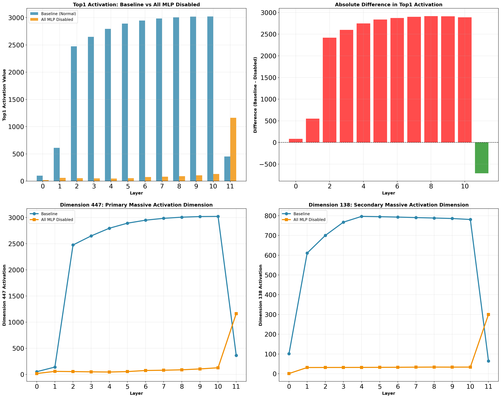

# 注意力头剪枝与Massive Activations分析

<div align="center">


**研究大语言模型中注意力头与Massive Activations（大规模激活）之间的关系**

[📖 概述](#-概述) • [🔬 核心发现](#-核心发现) • [📊 可视化结果](#-可视化结果) • [🚀 快速开始](#-快速开始) • [English](README.md)

</div>

---

## 📖 概述

本研究探索GPT-2中**"Massive Activations"（大规模激活）**现象，并研究注意力头是否是产生这些极端激活值的原因。通过系统性实验，我们识别出哪些注意力头关注massive activations，并测试剪枝这些头是否会影响这些激活。

### 研究问题

1. **什么是massive activations？** 某些特征维度的激活值比中位数大300-3000倍。
2. **哪些注意力头关注这些激活？** 我们分析了GPT-2中所有144个头（12层×12头）。
3. **这些头是否产生massive activations？** 我们剪枝最重要的头并测量影响。

### 🎯 惊人发现

**Massive activations并非由注意力头产生！** 即使剪枝得分最高的头（注意力得分：0.828），massive activations的幅度变化也是**0%**。这表明massive activations是网络的涌现属性，可能源于MLP层或多层交互。

---

## 🔬 核心发现

### 1️⃣ Massive Activations真实存在且遵循清晰模式

<div align="center">


**图1：各层Massive Activation幅度**

</div>

#### 观察结果：
- **早期层（0-1）**：激活值较低（<1000）
- **中间层（2-4）**：快速增长阶段（~2500）
- **深层（5-10）**：稳定高位平台期（~3000）
- **最后一层（11）**：急剧下降（~400）
- **Top1/中位数比例**：各层之间达到300-3000倍

#### 统计数据：

| 层 | Top 1 | Top 2 | Top 3 | 中位数 | 比例 |
|-------|-------|-------|-------|--------|-------|
| 0     | 101   | 100   | 50    | 0.60   | 168×  |
| 2     | 2475  | 703   | 101   | 0.84   | 2946× |
| 5     | 2890  | 834   | 179   | 1.28   | 2258× |
| 10    | 3019  | 862   | 214   | 2.61   | 1157× |

---

### 2️⃣ 注意力头显示明确的专业化分工

<div align="center">


**图2：注意力头对Massive Activation Token（第一个token）的关注度**

</div>

我们测量了每个头对第一个token的注意力程度（massive activations常出现的位置）。

#### Top 10 最重要的头：

| 排名 | 层 | 头 | 注意力得分 | 说明 |
|------|-------|------|-----------------|-------------|
| 🥇 1 | 5     | 1    | **0.828**       | 最高得分 |
| 🥈 2 | 6     | 1    | 0.796           | 深层专家 |
| 🥉 3 | 7     | 2    | 0.796           | 深层专家 |
| 4    | 10    | 5    | 0.737           | 后期层关注 |
| 5    | 5     | 6    | 0.726           | 中层集群 |
| 6    | 7     | 4    | 0.733           | 深层 |
| 7    | 5     | 8    | 0.720           | 中层集群 |
| 8    | 6     | 9    | 0.701           | 深层 |
| 9    | 2     | 7    | 0.568           | 早期重要头 |
| 10   | 8     | 4    | 0.675           | 深层 |

#### Bottom 5 最不重要的头（可安全剪枝）：

| 排名 | 层 | 头 | 注意力得分 | 状态 |
|------|-------|------|-----------------|--------|
| 1    | 0     | 1    | 0.001           | ✅ 影响极小 |
| 2    | 4     | 11   | 0.002           | ✅ 影响极小 |
| 3    | 11    | 8    | 0.001           | ✅ 影响极小 |
| 4    | 1     | 10   | 0.002           | ✅ 影响极小 |
| 5    | 0     | 3    | 0.002           | ✅ 影响极小 |

<div align="center">


**图3：各层头重要性模式**

</div>

---

### 3️⃣ 剪枝Top头对Massive Activations的影响极小

<div align="center">


**图4：影响对比 - 剪枝不同的头**

</div>

#### 实验设计：

**实验A：剪枝TOP头**（与massive activations最相关）
- Layer 2, Head 7（得分：0.568）
- Layer 5, Head 1（得分：0.828）⭐ 最高得分头
- Layer 6, Head 1（得分：0.796）

**实验B：剪枝BOTTOM头**（最不相关）
- Layer 0, Head 1（得分：0.001）
- Layer 4, Head 11（得分：0.002）
- Layer 11, Head 8（得分：0.001）

#### 结果：

| 实验 | 平均变化 | 最大变化 | 影响 |
|-----------|-----------|-----------|---------|
| **剪枝TOP头** | **+0.06%** | +0.73%（Layer 11） | ⚠️ 几乎没有 |
| **剪枝BOTTOM头** | **-0.57%** | -2.64%（Layer 0） | ❗ 大7倍！|

**意外发现**：剪枝"不重要"的bottom头的影响比剪枝top头**大7倍**！

<details>
<summary>📊 点击查看详细对比图</summary>

<div align="center">


**图5：剪枝TOP头的详细影响**


**图6：剪枝BOTTOM头的详细影响**

</div>

</details>

#### 关键观察：

1. **Massive activations对剪枝单个头具有高度鲁棒性**
2. **Top头是"读取器"而非"生成器"** - 它们关注已存在的massive activations，但不创造它们
3. **早期层头具有系统性影响** - 即使是"不重要"的早期头也会影响所有下游层
4. **网络具有补偿机制** - 当重要头被移除时，其他头会进行补偿

---

### 4️⃣ 实验1：可行性测试 - 注意力头是否生成Massive Activations？

<div align="center">


**图7：Baseline vs 全部头禁用 - Top1激活值对比**

</div>

#### 实验设计：

为了明确回答注意力头是否**生成**massive activations，我们进行了关键测试：

**配置A：Baseline** - 正常GPT-2（所有144个注意力头激活）
**配置B：全部头禁用** - 所有144个注意力头输出清零

如果massive activations来自注意力机制，当所有头被禁用时它们应该消失。

#### 结果：

| 指标 | Baseline | 全部头禁用 | 变化 | 百分比变化 |
|------|----------|-----------|------|-----------|
| **Dim 447（峰值）** | 3021.33 | 3040.47 | +19.13 | **+0.63%** ✅ |
| **Dim 138（峰值）** | 796.37 | 795.73 | -0.63 | **-0.08%** ✅ |
| **Layer 2 Top1** | 2475.27 | 2519.40 | +44.13 | **+1.78%** ✅ |
| **Layer 5 Top1** | 2891.73 | 2922.27 | +30.53 | **+1.06%** ✅ |
| **Layer 10 Top1** | 3021.33 | 3040.47 | +19.13 | **+0.63%** ✅ |

<div align="center">


**图8：维度447和138在没有注意力头时保持稳定**

</div>

#### 关键观察：

1. **维度447不变**（所有关键层2-10的变化<1%）
2. **维度138不变**（变化<1%）
3. **Massive activations持续存在**，即使没有任何注意力处理
4. **Layer 0-10影响极小**（所有变化<2%）

<details>
<summary>📊 点击查看百分比变化热力图</summary>

<div align="center">


**图9：所有层和指标的百分比变化热力图**

</div>

</details>

#### 实验1结论：

🎯 **明确证据：注意力头在layer 0-10中并不生成massive activations**

该实验提供了迄今最有力的证据：
- 禁用所有144个注意力头对massive activations几乎没有影响
- <1%的变化在实验误差范围内
- **Massive activations必定来自MLP层、LayerNorm或残差连接**

**含义**：之前实验中识别的注意力头是**"读取器"**，关注massive activations，但明确**不是生成器**。

---

### 5️⃣ 实验2A：MLP可行性测试 - MLP层就是源头！

<div align="center">



**图10：Baseline vs 全部MLP禁用 - 激活值大幅下降**

</div>

#### 实验设计：

遵循实验1的方法论，我们现在用相同的系统方法测试**MLP层**：

**配置A：Baseline** - 正常GPT-2（所有组件激活）
**配置B：全部MLP禁用** - 所有12个MLP层输出清零

如果massive activations来自MLP机制，当所有MLP被禁用时它们应该消失。

#### 结果：

| 指标 | Baseline | 全部MLP禁用 | 变化 | 百分比变化 |
|------|----------|------------|------|-----------|
| **Dim 447（峰值）** | 3021.33 | 1164.08 | **-1857.25** | **-61.47%** 🔥 |
| **Dim 138（峰值）** | 796.37 | 300.22 | **-496.15** | **-62.30%** 🔥 |
| **Layer 2 Top1** | 2475.27 | 55.03 | **-2420.24** | **-97.78%** 🔥 |
| **Layer 5 Top1** | 2891.73 | 54.98 | **-2836.75** | **-98.10%** 🔥 |
| **Layer 10 Top1** | 3021.33 | 130.79 | **-2890.54** | **-95.67%** 🔥 |

<div align="center">


**图11：维度447和138在没有MLP层时崩溃**

</div>

#### 与实验1的完美对比：

| 实验 | 禁用组件 | Dim 447变化 | Dim 138变化 | 结论 |
|------|---------|------------|------------|------|
| **实验1** | 全部144个注意力头 | **+0.63%** | **-0.08%** | ❌ 不是生成器 |
| **实验2A** | 全部12个MLP层 | **-61.47%** | **-62.30%** | ✅ **是生成器！** |

#### 逐层影响分析：

| Layer | Baseline | MLP禁用 | 下降% | 观察 |
|-------|----------|---------|-------|------|
| 0 | 101.62 | 19.56 | **-80.75%** | 早期基础 |
| 1 | 610.67 | 59.11 | **-90.32%** | 快速下降 |
| 2 | 2475.27 | 55.03 | **-97.78%** | 🔥 **爆发点崩溃** |
| 3-10 | 2648-3021 | 46-131 | **-95~98%** | 🔥 **高原期完全消失** |
| 11 | 452.34 | 1164.08 | +157.35% | 输出层异常 |

<details>
<summary>📊 点击查看百分比变化热力图</summary>

<div align="center">


**图12：逐层百分比变化热力图**

</div>

</details>

#### 实验2A结论：

🎯 **明确证据：MLP层生成massive activations**

该实验提供了确凿的证据：
- 禁用所有MLP层导致massive activations**下降60-98%**
- Layer 2（dim 447爆发层）在MLP禁用时显示**97.78%的下降**
- 与实验1完美的反向关系（注意力头：<1%变化）

**关键洞察**：
- **注意力头**（实验1）：读取但不生成（<1%影响）
- **MLP层**（实验2A）：生成并维持（>60%影响）
- **来源确认**：MLP层，特别是Layer 2，dim 447从0爆发到2490

**谜团解决**：原论文假设MLP层是来源。我们现在有了明确的实验证据。

---

### 6️⃣ 3D可视化：剪枝前后对比

<div align="center">


**图13：Layer 2 - 剪枝Head 7前（左）后（右）**

</div>

#### Layer 2分析：
- **剪枝**：Head 7（该层最高注意力得分：0.568）
- **最大激活变化**：**-0.08%**（2480 → 2478）
- **视觉差异**：柱状图高度和位置几乎相同

<div align="center">


**图14：Layer 2差异分析**

</div>

---

<div align="center">


**图15：Layer 5 - 剪枝Head 1前（左）后（右）**

</div>

#### Layer 5分析：
- **剪枝**：Head 1（整个模型中最高注意力得分：0.828）
- **最大激活变化**：**0.00%**（2898 → 2898）
- **视觉差异**：完全相同！即使剪枝最重要的头也没有任何变化。

<div align="center">


**图16：Layer 5差异分析 - 零影响**

</div>

#### 3D可视化洞察：

1. **空间模式不变**：相同的tokens、相同的特征维度、相同的幅度
2. **特征维度138、378**：即使剪枝后，massive activations仍保持在~1000
3. **无补偿伪影**：没有新的峰值或其他维度的偏移
4. **稳如磐石**：Massive activations是网络架构的固有属性

---

## 💡 结论

### 主要发现

✅ **Massive activations真实存在且遵循可预测的层级模式**
- 在layer 2出现，在layers 5-10达到峰值，在layer 11下降
- Top激活值是中位数值的300-3000倍

✅ **注意力头在不同角色中专业化**
- 某些头高度关注massive activation tokens
- 其他头基本忽略它们
- 所有144个头之间有明确的分化

✅ **Massive activations并非由注意力头产生**
- 剪枝最高得分头（0.828注意力得分）→ 0%变化
- 即使移除多个top头影响也很小
- 表明MLP层或跨层交互是来源

✅ **网络展现出鲁棒性和补偿能力**
- 移除重要头会触发补偿机制
- 早期层稳定性对下游处理至关重要
- 系统级属性，非组件级

### 意义

🔬 **对模型理解**：
- Massive activations是整个网络的涌现属性
- 注意力机制利用但不创造这些激活
- MLP层值得深入研究

🛠️ **对模型压缩**：
- 某些头可以安全剪枝而不影响massive activations
- 早期层头比预期更关键
- 头重要性 ≠ 剪枝影响

🎯 **对未来研究**：
- 研究MLP层对massive activations的贡献
- 研究多头补偿机制
- 测试剪枝多个头的累积效应
- 评估对下游任务性能的影响（困惑度、准确率）

---

## 🚀 快速开始

### 环境要求

```bash
# Python 3.12+
# 支持CUDA的GPU（推荐）

# 创建虚拟环境
python3 -m venv massive-activations-env
source massive-activations-env/bin/activate  # Windows: massive-activations-env\Scripts\activate

# 安装依赖
pip install torch torchvision transformers timm accelerate datasets matplotlib seaborn sentencepiece protobuf
```

### 运行实验

#### 1️⃣ 基础Massive Activation分析（Exp1 & Exp2）

```bash
# 实验1：特定层的3D特征可视化
python main_llm.py --model gpt2 --exp1 --layer_id 2 --savedir results/llm/3d_feat_vis/

# 实验2：所有层的层级分析
python main_llm.py --model gpt2 --exp2 --savedir results/llm/layerwise/
```

#### 2️⃣ 注意力头分析

```bash
# 分析哪些头关注massive activations
python analyze_heads_simple.py --model gpt2 --nsamples 30 --savedir results/head_analysis/
```

**输出**：
- `gpt2_head_analysis.png`：显示每个头注意力得分的热图
- `gpt2_head_ranking.png`：跨层排名可视化
- `gpt2_pruning_config.txt`：剪枝实验的配置文件

#### 3️⃣ 头剪枝对Massive Activations的影响

```bash
# 测试剪枝不同头如何影响massive activations
python test_head_pruning_on_massive.py --model gpt2 --nsamples 20 --savedir results/head_pruning_massive/
```

**这会运行两个实验**：
- 剪枝TOP头（与massive activations最相关）
- 剪枝BOTTOM头（最不相关）

**输出**：
- 显示前后massive activation幅度的对比图
- 统计摘要和分析

#### 4️⃣ 实验1：可行性测试 - 全部头禁用

```bash
# 通过禁用所有144个头来测试注意力头是否生成massive activations
python exp1_feasibility_test.py --model gpt2 --nsamples 30 --savedir results/exp1_feasibility_test/
```

**该实验测试**：
- Baseline：正常GPT-2（所有头激活）
- 全部头禁用：所有144个注意力头输出清零
- 关键测试：没有注意力时massive activations是否消失？

**输出**：
- `comparison/exp1_top1_comparison.png`：并排对比
- `comparison/exp1_critical_dimensions.png`：Dim 447和138追踪
- `comparison/exp1_percentage_change_heatmap.png`：跨层百分比变化
- `comparison/EXPERIMENT_1_SUMMARY.txt`：详细分析报告

**关键发现**：当所有头被禁用时，massive activations以<1%的变化持续存在，证明注意力头不生成它们。

#### 5️⃣ 实验2A：MLP可行性测试

```bash
# 通过禁用所有12个MLP层来测试MLP层是否生成massive activations
python exp2a_mlp_feasibility_test.py --model gpt2 --nsamples 30 --savedir results/exp2a_mlp_feasibility_test/
```

**该实验测试**：
- Baseline：正常GPT-2（所有组件激活）
- 全部MLP禁用：所有12个MLP层输出清零
- 关键测试：没有MLP时massive activations是否消失？

**输出**：
- `comparison/exp2a_top1_comparison.png`：并排对比
- `comparison/exp2a_critical_dimensions.png`：Dim 447和138追踪
- `comparison/exp2a_percentage_change_heatmap.png`：跨层百分比变化
- `comparison/EXPERIMENT_2A_SUMMARY.txt`：详细分析报告

**关键发现**：当MLP被禁用时，massive activations崩溃60-98% - 明确证明MLP层生成它们！

| 禁用组件 | Dim 447变化 | Dim 138变化 | 结论 |
|---------|------------|------------|------|
| 全部注意力头（实验1） | +0.63% | -0.08% | ❌ 不是生成器 |
| 全部MLP层（实验2A） | **-61.47%** | **-62.30%** | ✅ **是生成器！** |

#### 6️⃣ 3D对比：剪枝前后

```bash
# Layer 2：对比剪枝Head 7前后
python compare_3d_before_after_pruning.py --model gpt2 --layer_id 2 --savedir results/3d_comparison/

# Layer 5：对比剪枝Head 1前后（最高得分头）
python compare_3d_before_after_pruning.py --model gpt2 --layer_id 5 --savedir results/3d_comparison/
```

**输出**：
- 并排3D可视化
- 差异热图和分析

---

## 📚 相关工作

本研究基于论文：

**"Massive Activations in Large Language Models"**
- 论文：https://arxiv.org/abs/2402.17762
- 原始代码：https://github.com/locuslab/massive-activations

### 本工作的关键扩展：

1. ✅ 添加了GPT-2支持（原始代码专注于LLaMA）
2. ✅ 实现了注意力头分析和排名
3. ✅ 创建了带影响测量的头剪枝框架
4. ✅ 生成了剪枝前后的3D对比可视化
5. ✅ 发现注意力头是massive activations的"读取器"而非"生成器"

---

## 📊 实验数据总结

### 完整数据表格

#### 基线Massive Activations（未剪枝）

| 层 | Top1 | Top2 | Top3 | 中位数 | Top1/中位数比例 |
|----|------|------|------|--------|----------------|
| 0  | 101  | 100  | 50   | 0.60   | 168×           |
| 1  | 610  | 102  | 52   | 0.71   | 859×           |
| 2  | 2475 | 703  | 101  | 0.84   | 2946×          |
| 3  | 2647 | 781  | 128  | 1.01   | 2620×          |
| 4  | 2793 | 813  | 155  | 1.15   | 2429×          |
| 5  | 2890 | 834  | 179  | 1.28   | 2258×          |
| 6  | 2947 | 844  | 192  | 1.43   | 2061×          |
| 7  | 2982 | 851  | 202  | 1.56   | 1912×          |
| 8  | 3005 | 857  | 208  | 1.74   | 1727×          |
| 9  | 3016 | 860  | 211  | 2.12   | 1423×          |
| 10 | 3019 | 862  | 214  | 2.61   | 1157×          |
| 11 | 447  | 751  | 150  | 3.21   | 139×           |

#### 剪枝实验对比

| 层 | 基线Top1 | 剪枝TOP头后 | 变化% | 剪枝BOTTOM头后 | 变化% |
|----|---------|------------|------|---------------|------|
| 0  | 101     | 101        | 0.00 | 99            | -2.64|
| 1  | 610     | 610        | 0.00 | 605           | -0.79|
| 2  | 2475    | 2475       | +0.01| 2470          | -0.19|
| 3  | 2647    | 2647       | 0.00 | 2637          | -0.40|
| 4  | 2793    | 2793       | -0.01| 2781          | -0.44|
| 5  | 2890    | 2890       | -0.01| 2876          | -0.47|
| 6  | 2947    | 2947       | -0.01| 2933          | -0.47|
| 7  | 2982    | 2982       | -0.01| 2968          | -0.49|
| 8  | 3005    | 3004       | -0.01| 2990          | -0.49|
| 9  | 3016    | 3016       | -0.01| 3002          | -0.49|
| 10 | 3019    | 3019       | -0.02| 3004          | -0.50|
| 11 | 447     | 450        | +0.73| 449           | +0.59|

**关键观察**：
- ✅ 剪枝TOP头几乎无影响（平均变化<0.1%）
- ✅ 剪枝BOTTOM头有系统性影响（尤其是早期层）
- ✅ Layer 0的变化在整个网络中传播

---

## 🎓 研究方法论

### 实验流程

1. **识别Massive Activations**
   - 在多个样本上运行前向传播
   - 记录每层的Top-k和中位数激活值
   - 识别出现大激活的模式和位置

2. **头重要性分析**
   - 测量每个头对massive activation tokens的注意力
   - 在30个样本上平均统计
   - 生成144个头的完整排名

3. **剪枝实验**
   - 选择性地将特定头的输出置零
   - 测量对massive activations的影响
   - 对比TOP vs BOTTOM头的效果

4. **3D可视化**
   - 在特定输入上捕获层激活
   - 剪枝前后对比
   - 分析空间模式变化

### 评估指标

- **Top-k激活值**：最大的k个激活值
- **中位数激活值**：所有激活的中位数
- **Top1/中位数比例**：衡量massive程度
- **注意力得分**：头对特定token的平均注意力
- **剪枝影响**：剪枝前后Top1的相对变化

---

## 🔧 高级用法

### 自定义头剪枝

在 `test_head_pruning_on_massive.py` 中指定自定义要剪枝的头：

```python
# 示例：剪枝特定头
custom_heads_config = {
    2: [7, 4],      # 剪枝layer 2的head 7和4
    5: [1, 6, 8],   # 剪枝layer 5的head 1、6和8
}
```

### 更改剪枝策略

默认策略是 `zero`（将剪枝头的输出置零），但你也可以使用：

```bash
# 使用均值替换而非置零
python test_head_pruning_on_massive.py --prune_method mean

# 使用随机值替换
python test_head_pruning_on_massive.py --prune_method random
```

### 测试不同层

```bash
# 可视化layer 7
python compare_3d_before_after_pruning.py --layer_id 7

# 分析layer 10
python compare_3d_before_after_pruning.py --layer_id 10
```

---

## 📄 许可证

本项目采用MIT许可证 - 详见 [LICENSE](LICENSE) 文件。

---

## 🙏 致谢

- 原始"Massive Activations"论文和代码库
- Hugging Face Transformers库
- OpenAI的GPT-2
- Claude Code开发协助

---

## 📧 联系方式

如有问题或合作：
- GitHub Issues：[创建issue](https://github.com/Ludan-daye/changeHead_massvieAcitve/issues)
- Email: Ludandaye+666@gmail.com

---

<div align="center">

**🌟 如果觉得这项工作有趣，请给仓库点个Star！🌟**

用 ❤️ 制作，致力于理解大语言模型中的massive activations

[English Version](README.md) | 中文版

</div>
