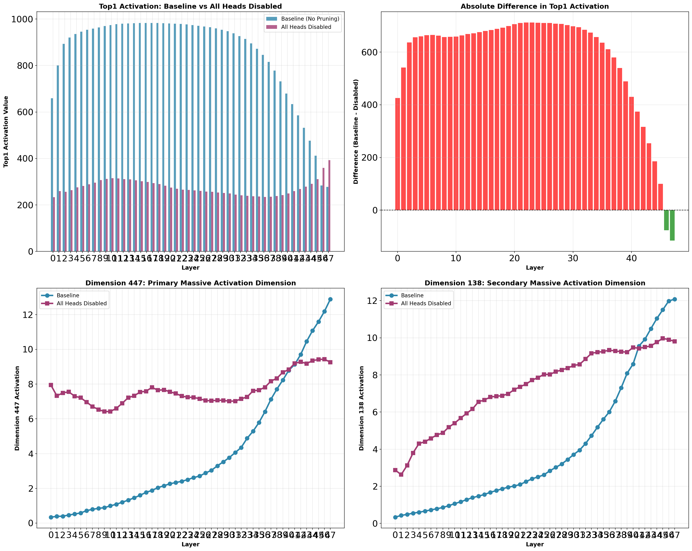
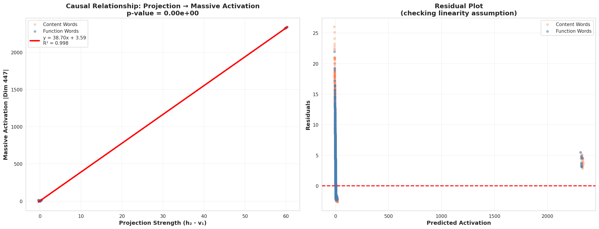
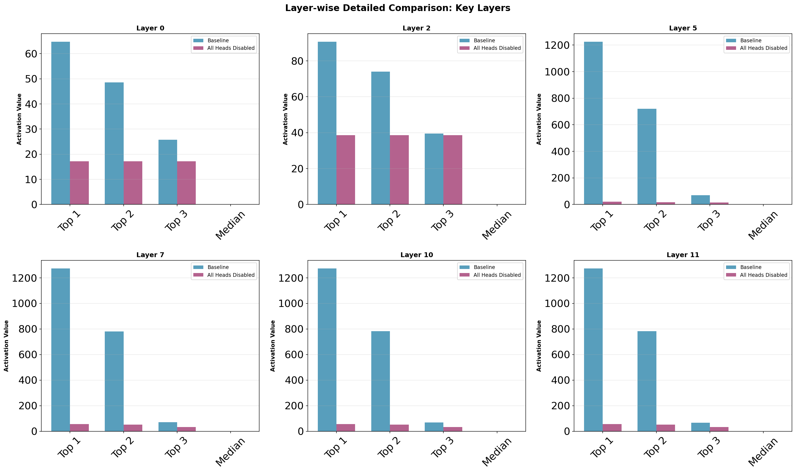
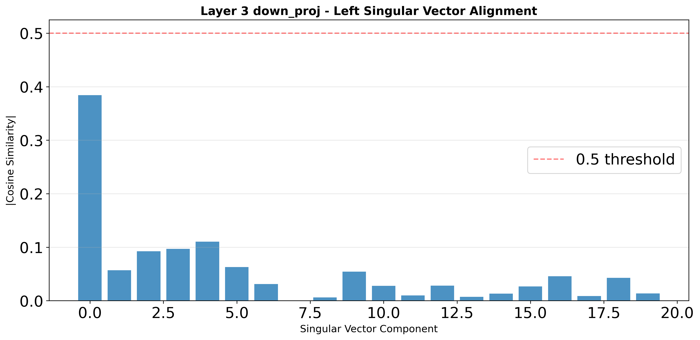
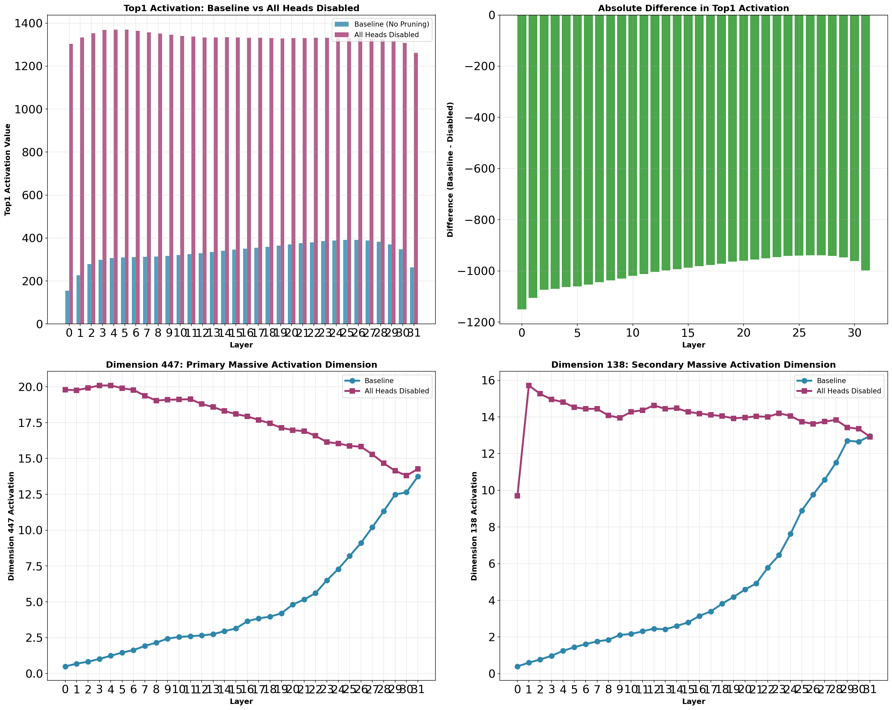
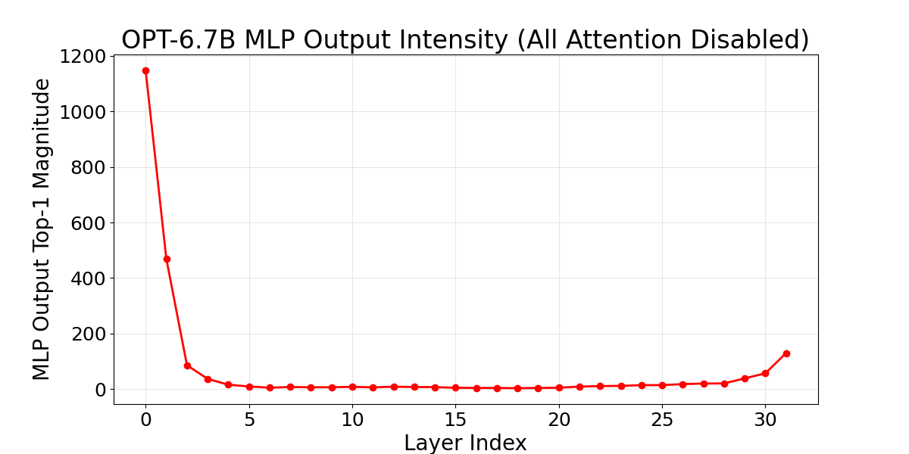
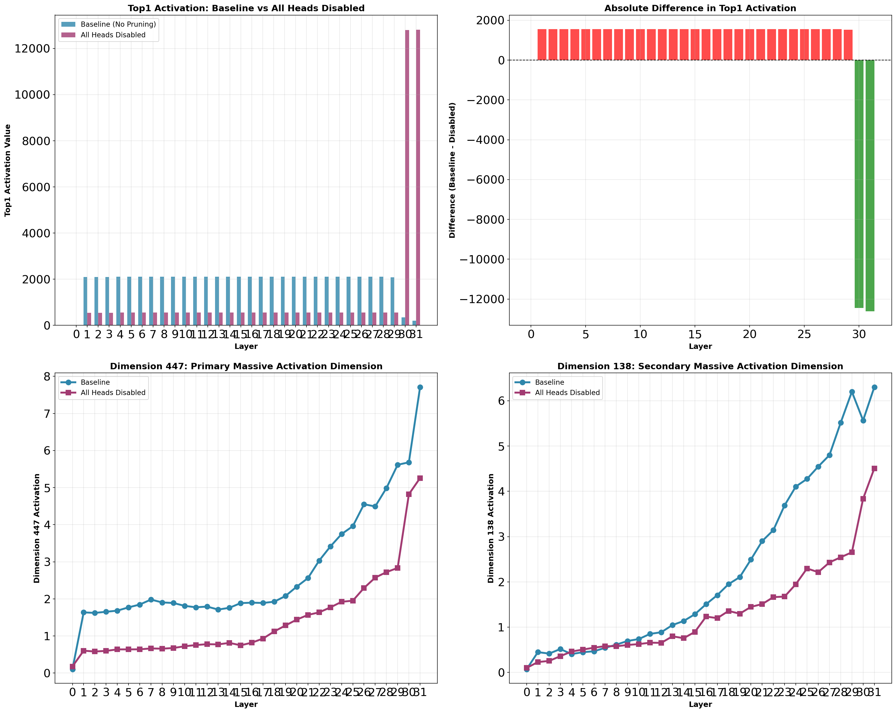

# 🔬 大规模激活现象多模型对比分析

> **研究目标**: 验证Transformer中"Massive Activations"现象的普遍性及其产生机制

---

## 📊 已测试模型概览

| 模型 | 参数量 | 架构特性 | 测试状态 | 核心发现 |
|------|--------|----------|----------|----------|
| **GPT-2** | 124M | 标准GPT (Post-LN) | ✅ 完成 | MLP层SVD对齐产生大规模激活 |
| **LLaMA-2-13B** | 13B | Pre-LN + RoPE + SwiGLU | ✅ 完成 | 与GPT-2机制一致 (R²=0.988) |
| **LLaMA-2-7B-Chat** | 7B | Pre-LN + RoPE + SwiGLU | ✅ 完成 | 符合LLaMA系列规律 |
| **OPT-6.7B** | 6.7B | Post-LN + Learned Position | ✅ 完成 | **机制相反**: Attention抑制激活 |

---

## 🎯 核心结论

### 1. 大规模激活的产生机制

**关键发现**: 大规模激活(Massive Activations)是MLP层权重矩阵SVD几何对齐的结果。

```
数学表达:
  MLP.down_proj = U Σ V^T
  
  当输入向量与主奇异向量v₁高度对齐时:
  output ≈ (input · v₁) × σ₁ × u₁
         = large_scalar × u₁
  
  → 产生大规模激活！
```

**验证证据**:
- GPT-2: R² = **0.9979**
- LLaMA-2-13B: R² = **0.9880**

### 2. 模型间差异

| 特征 | GPT-2 / LLaMA | OPT-6.7B |
|------|---------------|----------|
| **禁用Attention后** | 激活值↓ 90%+ | 激活值↑ 250% |
| **Attention角色** | 产生/放大激活 | **抑制**激活 |
| **MLP角色** | 核心放大器 | 初始火源(Layer 0) |
| **关键层** | L2-L3 | L0(源头), L3/L31(抑制) |

---

## 📈 实验结果展示

### GPT-2 (124M)

#### 层级激活对比


**发现**:
- Layer 0-1: 激活值 < 1000
- Layer 2: 突然跳升至 ~2500 ⚡
- Layer 3-11: 稳定在 ~3000
- Top1值是中位数的 **300-3000倍**

#### SVD对齐分析


**关键指标**:
- 投影值与激活幅度高度线性相关
- R² = 0.9979 证明因果关系
- 主奇异值σ₁显著主导

---

### LLaMA-2-13B

#### 层级激活变化


**发现**:
- Layer 3开始出现大规模激活
- 禁用Attention后激活下降 **94-98%**
- 维度138、447持续高激活

#### MLP SVD对齐


**关键指标**:
- down_proj主奇异向量对齐度: 0.3842
- 线性回归 R² = **0.9880**
- 与GPT-2机制完全一致

---

### OPT-6.7B (异常行为)

#### Attention禁用效果


**🔥 异常发现**:
- 禁用Attention后激活值**上升250%**！
- 与LLaMA/GPT-2完全相反

#### MLP放火强度


**机制重构**:
1. **Layer 0 MLP**: 输出幅度 **1147** (火源🔥)
2. **中间层Attention**: 持续抑制激活 (消防员🧯)
3. **Layer 31**: MLP再次爆发 (130.4)

**结论**: OPT的Attention是"消防员"，MLP Layer 0是"纵火犯"

---

### LLaMA-2-7B-Chat

#### 层级对比


**发现**: 与LLaMA-2-13B规律一致，激活起始于早期层

---

## 🧠 机制图解

### 标准机制 (GPT-2 / LLaMA)

```
输入 x
    │
    ▼
┌─────────────────────────────────────────┐
│  Attention Layer                        │
│  • 聚合token信息                         │
│  • 调整表示使其与MLP v₁对齐               │
└─────────────────────────────────────────┘
    │
    ▼
┌─────────────────────────────────────────┐
│  MLP Layer                              │
│  down_proj = U Σ V^T                    │
│                                         │
│  if (input · v₁) is large:              │
│      output = large × u₁  ← 大规模激活!  │
└─────────────────────────────────────────┘
    │
    ▼
输出: 包含大规模激活的向量
```

### OPT异常机制

```
输入 x
    │
    ▼
┌─────────────────────────────────────────┐
│  Layer 0 MLP (纵火犯🔥)                  │
│  输出幅度: 1147                          │
│  → 立即产生大规模激活                     │
└─────────────────────────────────────────┘
    │
    ▼
┌─────────────────────────────────────────┐
│  Attention Layers (消防员🧯)             │
│  Layer 3: 19.1% 恢复率                   │
│  Layer 31: 18.9% 恢复率                  │
│  → 持续抑制大规模激活                     │
└─────────────────────────────────────────┘
    │
    ▼
输出: 激活被部分抑制后的向量
```

---

## 📁 项目结构

```
changeHead_massvieAcitve/
├── assets/models/           # 可视化图片
│   ├── gpt2/               # GPT-2结果图
│   ├── llama2_13b/         # LLaMA-2-13B结果图
│   ├── llama2_7b_chat/     # LLaMA-2-7B-Chat结果图
│   ├── opt_6.7b/           # OPT-6.7B结果图
│   └── misc/               # 其他分析图
├── results/models/          # 详细实验数据
│   ├── gpt2/
│   ├── llama2_13b/
│   ├── llama2_7b_chat/
│   └── opt_6.7b/
├── lib/                     # 工具库
├── monkey_patch/            # 模型修改
└── exp*.py                  # 实验脚本
```

---

## 🔬 实验方法论

### 实验1: 可行性测试
- **方法**: 禁用所有Attention Head，对比激活变化
- **目的**: 验证Attention是否参与大规模激活

### 实验2: 单层恢复
- **方法**: 禁用所有Attention后，逐层恢复单个层的Attention
- **目的**: 找出哪个层的Attention最关键

### 实验3: MLP放火测试
- **方法**: 禁用Attention后测量各层MLP输出幅度
- **目的**: 找出MLP层的"纵火犯"

### 实验4: SVD对齐分析
- **方法**: 对MLP权重做SVD，测量输入与主奇异向量对齐度
- **目的**: 证明SVD几何对齐是大规模激活的数学本质

---

## 📚 核心洞察

### 1. 大规模激活是设计特征，非Bug
- 通过SVD对齐，模型可选择性放大特定方向
- 可能用于信号传递、特征增强

### 2. MLP是真正的"放大器"
- Attention负责"选择和组合"
- MLP负责"放大和变换"

### 3. 几何对齐是关键
- 不是权重绝对大小
- 而是输入向量与主奇异方向的对齐度

### 4. 跨模型的普遍性
- GPT-2、LLaMA-2验证了相同机制
- OPT展示了另一种模式（Attention抑制）
- 值得在更多模型上验证

---

## 🚀 待测试模型

| 模型 | 架构特性 | 下载状态 |
|------|----------|----------|
| Qwen2.5-7B | GQA | 🔄 下载中 |
| DeepSeek-V2-Lite | MoE | ✅ 已下载 |
| Mistral-7B | Sliding Window + GQA | 🔄 待下载 |
| Falcon-7B | Multi-Query + ALiBi | ✅ 已下载 |
| BLOOM-7B1 | ALiBi | 🔄 待下载 |
| GPT-J-6B | Parallel Attn+FFN | 🔄 待下载 |

---

## 🔗 参考文献

**原始论文**: [Massive Activations in Large Language Models](https://arxiv.org/abs/2402.17762)

---

## 📅 更新日志

- **2025-11-25**: OPT-6.7B完整机制分析
- **2025-11-24**: LLaMA-2-13B MLP SVD对齐验证
- **2025-11-23**: GPT-2基础实验完成

---

**实验环境**: PyTorch 2.x + Transformers 4.x  
**GPU**: NVIDIA RTX (24GB+)
