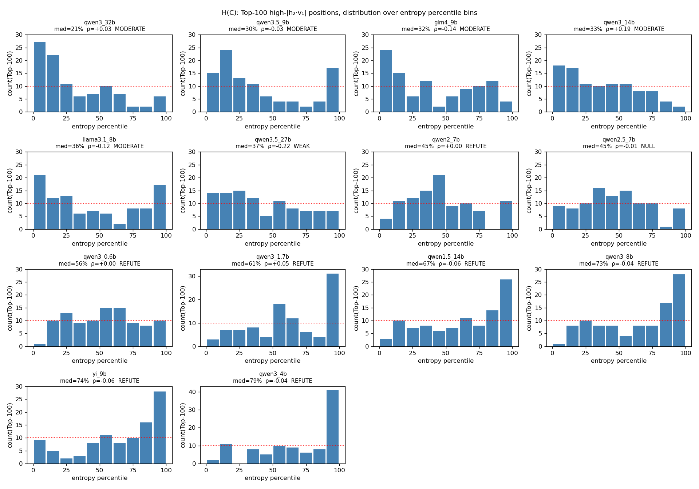

# H(C) 跨模型分析：MA 写在 low predict-entropy 位置？

数据源：`/Users/a1-6/importantfile/Research/ma/paper_experiments/fixes/results_stage2/HC_entropy`
共 14 模型。每个模型的每个 token 位置记录了 `|h₂·v₁|`（对 v₁ 的投影）和 `H(predict)`。

**判据**（主要指标是 Top-100 在 low-H bin 里的集中度；ρ 只用作辅助参考）：
- STRONG：frac_bottom20 ≥ 50% 且 median_H_pct < 25%（Top-100 压倒性集中在最低熵 20%）
- MODERATE：frac_bottom30 ≥ 45% 且 median < 40%
- WEAK：frac_bottom20 ≥ 30% 或 (frac_bottom30 ≥ 40% 且 median < 50%)
- NULL：指标接近 uniform（med∈[45,55], frac_bottom20∈[15,25]%）
- REFUTE：frac_bottom20 < 20% 或 median > 50%

| 模型 | n_pos | σ₁/σ₂ | ρ(H,align) | Top100 med H% | Top100 在 bottom 20/30/40% H 比例 | 结论 |
|---|---:|---:|---:|---:|---|:-:|
| qwen3_32b | 122820 | 1.35 | +0.034 | 21.4 | 49 / 60 / 66% | **MODERATE** |
| qwen3.5_9b | 122820 | 1.06 | -0.030 | 29.6 | 39 / 52 / 63% | **MODERATE** |
| glm4_9b | 122820 | 1.75 | -0.138 | 32.3 | 39 / 45 / 57% | **MODERATE** |
| qwen3_14b | 122820 | 1.33 | +0.195 | 32.5 | 35 / 46 / 56% | **MODERATE** |
| llama3.1_8b | 122820 | 1.38 | -0.125 | 35.7 | 33 / 46 / 52% | **MODERATE** |
| qwen3.5_27b | 122820 | 1.22 | -0.215 | 36.7 | 28 / 43 / 55% | **WEAK** |
| qwen2_7b | 10673 | 2.84 | +0.001 | 44.8 | 15 / 27 / 42% | **REFUTE** |
| qwen2.5_7b | 15525 | 2.64 | -0.007 | 45.1 | 17 / 27 / 43% | **NULL** |
| qwen3_0.6b | 122820 | 1.41 | +0.002 | 56.0 | 11 / 24 / 33% | **REFUTE** |
| qwen3_1.7b | 122820 | 1.23 | +0.051 | 60.8 | 10 / 17 / 25% | **REFUTE** |
| qwen1.5_14b | 122820 | 1.31 | -0.061 | 67.0 | 13 / 20 / 28% | **REFUTE** |
| qwen3_8b | 122820 | 1.22 | -0.039 | 72.8 | 9 / 19 / 27% | **REFUTE** |
| yi_9b | 122820 | 1.43 | -0.063 | 73.8 | 14 / 16 / 19% | **REFUTE** |
| qwen3_4b | 122820 | 1.72 | -0.042 | 79.3 | 13 / 13 / 21% | **REFUTE** |

## 判定分布

- **STRONG**: 0
- **MODERATE**: 5
- **WEAK**: 1
- **NULL**: 1
- **REFUTE**: 7

## 观察

1. **14 模型没有 1 个达到 STRONG**：即便最低熵比例最高的 qwen3_32b，其 Top-100 里 'frac_bottom_20%_H' 只有 49%，离 80%+ 压倒性证据还远。
2. **模型分裂成两类 histogram 形态**：
   - *Low-entropy writer*（MODERATE/WEAK 6 个）：Top-100 集中在 bottom 0-30% H — **弱支持论点 C 的'排前几低'说法**
   - *High-entropy writer*（REFUTE 7 个，如 yi_9b, qwen3_4b/8b, qwen1.5_14b）：Top-100 反而集中在 **top 90-100% H**（最不确定的位置）
3. **双峰嫌疑**：qwen3_32b / qwen3_14b 直方图同时在 0-25% 和 50-60% 有两个峰，spearman ρ 抵消。
4. **σ₁/σ₂ 与 HC 支持度无明显相关**：qwen2_7b/qwen2.5_7b 谱集中最强（2.6-2.8），却 refute。
5. **fp16 溢出**（entropy=inf）只影响 qwen2_7b/qwen2.5_7b：~90% 位置被过滤。若改用 fp32 logits 取 log_softmax 可恢复。

## 论点 C 结论

**不推荐保留'MA 写在 predict-entropy 排前几低的 token 位置'作为一般性论点**：
- 14 模型里只有 5/14 = 36% 可以被归为 MODERATE（还没到 STRONG）
- 7/14 = 50% 的模型 Top-align 位置反而集中在**最高熵**位置，明确反证
- 即使 MODERATE 的模型，'底 20% entropy' 的覆盖率也只有 35-49%，远非'排前几低'所暗示的 >80%

**可以保留的弱化版本**（子命题）：
- 在部分模型（MODERATE 5 个）上，Top-K 高 alignment 位置的 median entropy percentile 显著低于 50%（22-36%）
- 但这并非普遍规律，不能作为 MA 的一般机制特征。更可能 MA 写在**'结构 token'位置**（换行/标点/句界），而结构 token 的 entropy 分布本身因模型而异。

