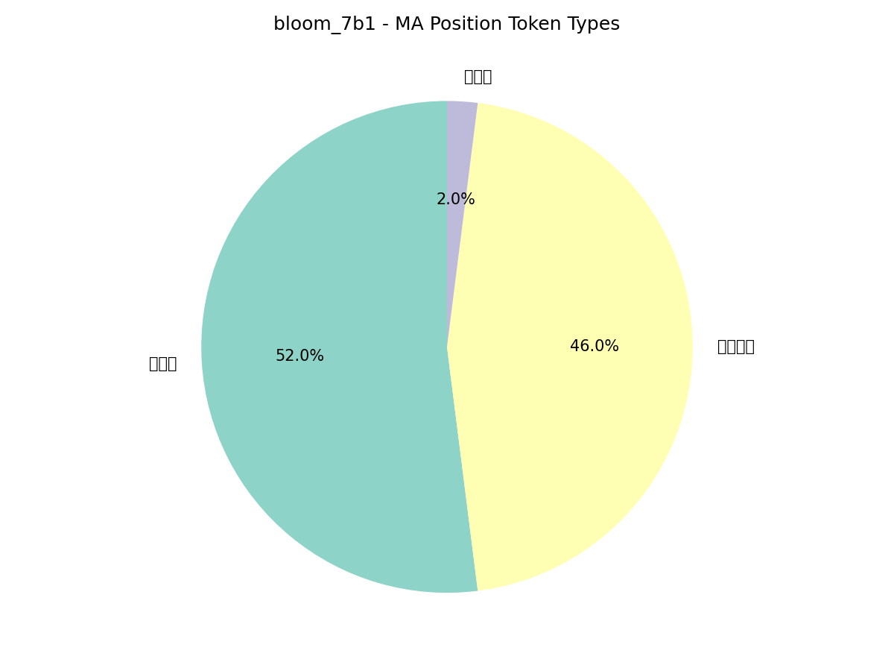

# RQ3: 功能词触发分析 - bloom_7b1

## 研究问题

**MA倾向于出现在哪些token位置？是否集中在无语义的功能词？**

## 实验设计

- 运行10个样本（seqlen=512）
- 找出每个样本Top5 MA位置
- 统计这50个位置对应的token类型

## Token类型定义

- **标点符号**: `, . ; : ! ?` 等
- **空白/换行**: 空格、`\n` 等
- **功能词**: `the, a, of, to, in, on, and` 等无实际语义的连接词
- **实义词**: 有实际语义的词
- **特殊token**: `<s>, </s>` 等

## 实验结果

**无语义词总占比**: **98.0%**

### Token类型分布

| 类型 | 数量 | 占比 |
|------|------|------|
| 功能词 | 26 | 52.0% |
| 标点符号 | 23 | 46.0% |
| 实义词 | 1 | 2.0% |

## 分析

✅ **MA主要出现在无语义词位置**

该模型有98.0%的MA出现在功能词、标点或空白符位置，说明MA确实倾向于出现在文本结构性标记而非实际内容词位置。

## 可视化

## 相关数据

- 全局数据: [`MA_POSITION_TOKEN_ANALYSIS.json`](../../MA_POSITION_TOKEN_ANALYSIS.json)
