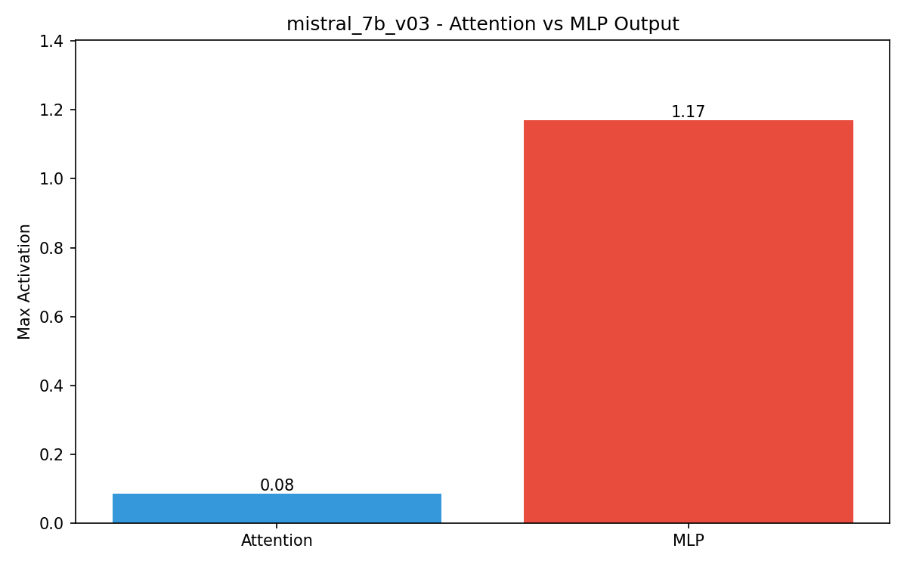

# RQ2: MLP层来源分析 - mistral_7b_v03

## 研究问题

**MA是在Attention还是MLP中产生的？**

## 实验设计

Hook关键层的Attention和MLP输出，对比最大激活值。

## 实验结果

| 模块 | 输出Max |
|------|---------|
| Attention | 0.08 |
| **MLP** | **1.17** |

**MLP/Attention比值**: 13.85x

## 结论

✅ **MA来自MLP输出**

MLP的输出激活值远大于Attention输出，证明MA在MLP模块中产生。

## 可视化

## 相关数据

- [`verification.json`](verification.json)
