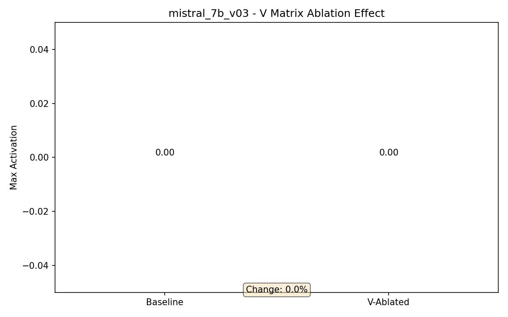

# RQ5: V矩阵消融分析 - mistral_7b_v03

## 研究问题

**MLP的V矩阵（右奇异向量）对MA的影响有多大？**

## 实验设计

对MLP down_proj权重进行SVD分解: `W = UΣVᵀ`

将V矩阵替换为随机正交矩阵，对比MA变化。

## 实验结果

| 指标 | 数值 |
|------|------|
| Baseline MA | 0.00 |
| 消融后MA | 0.00 |
| **变化量** | 0.00 |
| **变化率** | **0.0%** |

## 分析

⚠️ **V矩阵影响较弱**

消融V矩阵后MA变化0.0%，说明V矩阵不是MA生成的主要因素。

## 可视化

## 相关数据

- [`data/v_ablation_simple.json`](data/v_ablation_simple.json)
- [`data/README.md`](data/README.md)
